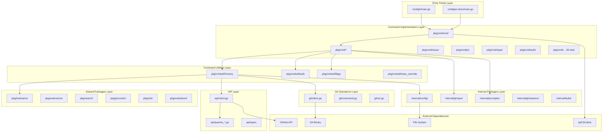
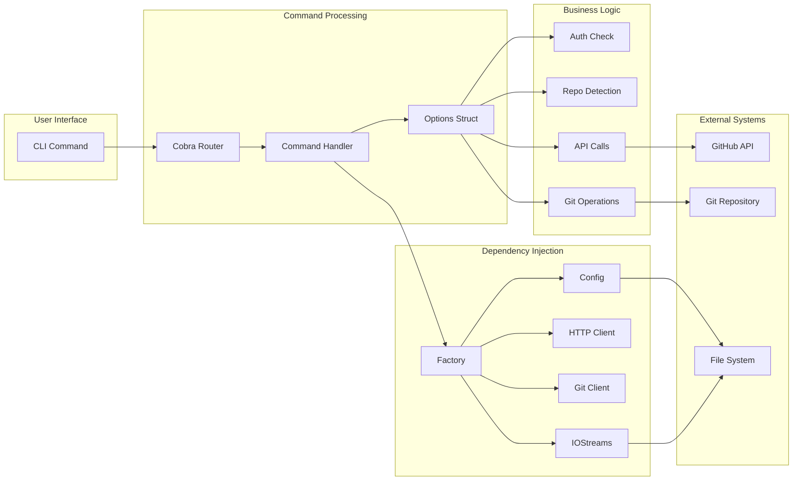
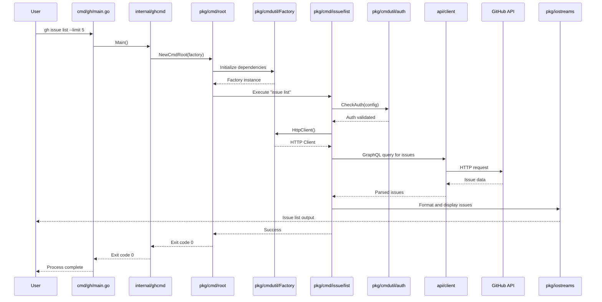
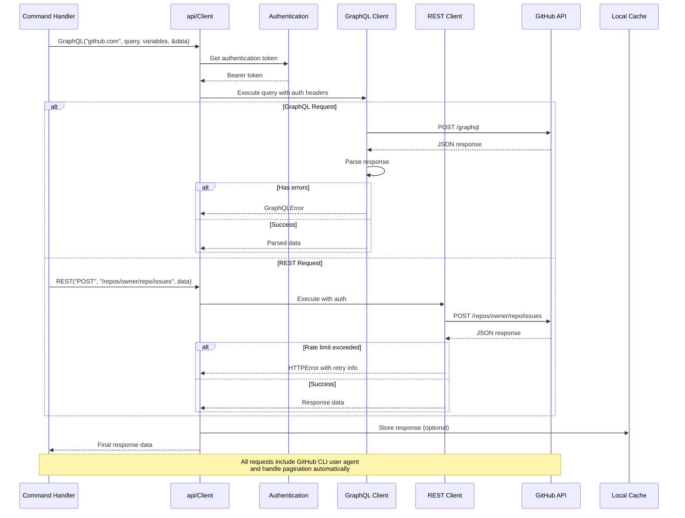
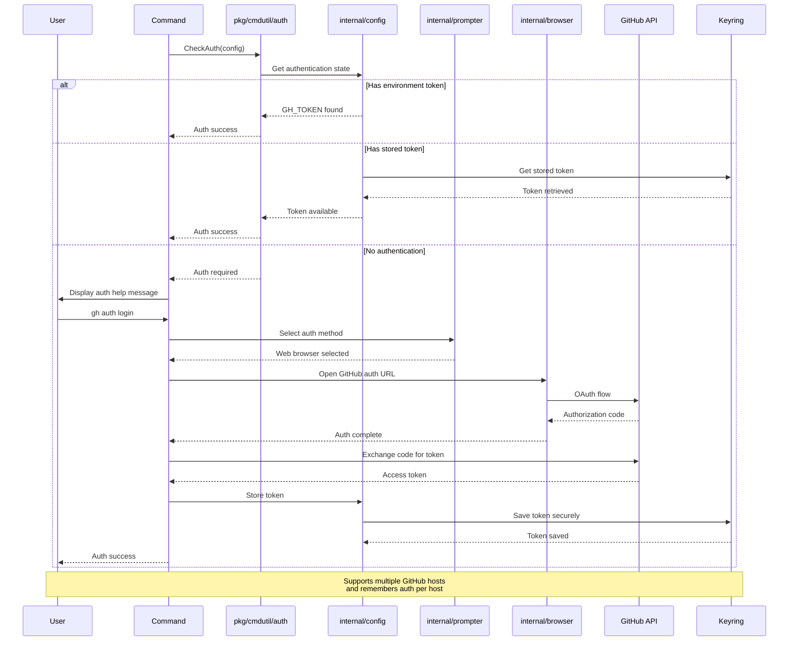
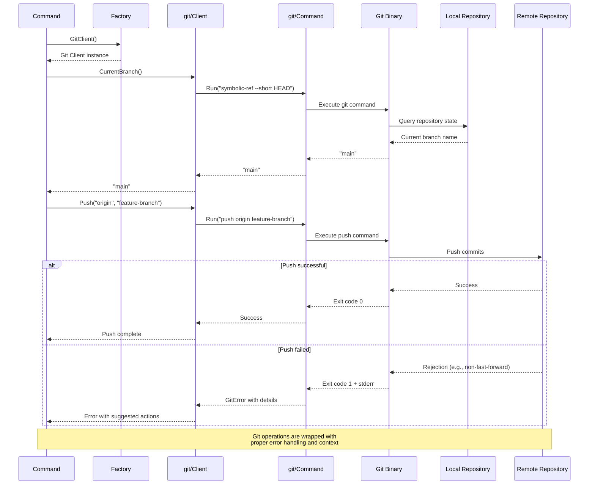
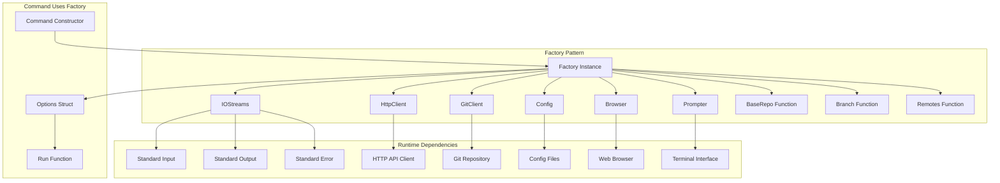
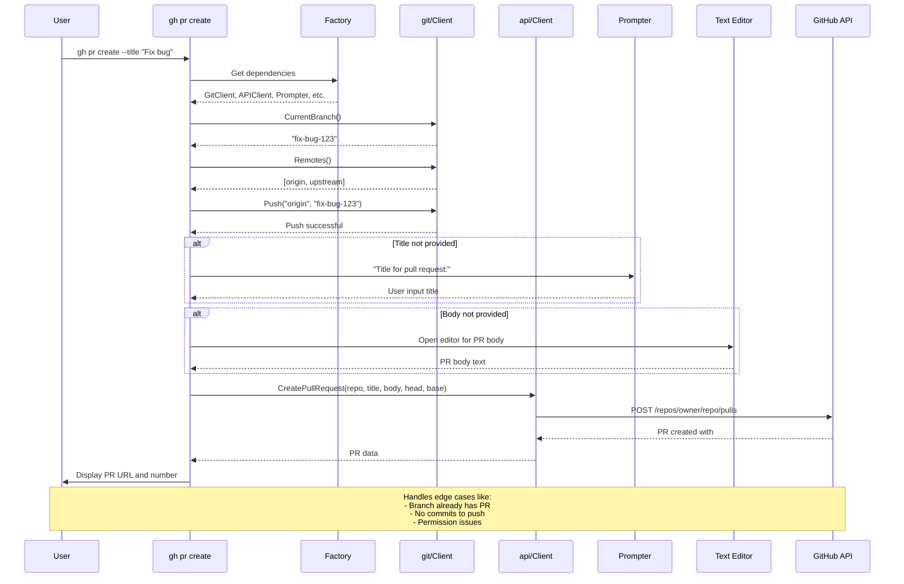
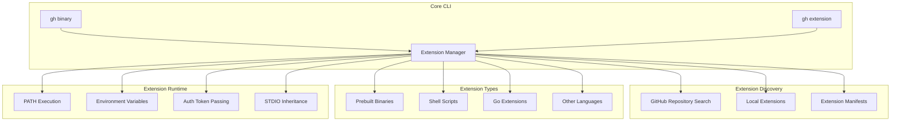

# GitHub CLI Architecture Documentation

This document provides comprehensive architecture diagrams for the GitHub CLI project using Mermaid notation.

## Overall Layered Architecture

## Component Interaction Flow

## Command Execution Sequence Diagram

## API Interaction Sequence Diagram

## Authentication Flow Diagram

## Git Operations Sequence Diagram

## Factory Dependency Injection Pattern

## Complete Pull Request Creation Flow

## Extension System Architecture

## Data Flow Summary

This architecture follows these key principles:

1. **Separation of Concerns**: Each layer has a distinct responsibility
2. **Dependency Injection**: Factory pattern provides testable dependencies
3. **Interface-Driven Design**: Components interact through well-defined interfaces
4. **Error Handling**: Comprehensive error handling with user-friendly messages
5. **Cross-Platform Support**: Abstractions handle platform differences
6. **Extensibility**: Plugin system allows community extensions
7. **Testing**: Architecture enables comprehensive unit and integration testing

The GitHub CLI successfully combines command-line usability with GitHub's rich API functionality through this well-structured, maintainable architecture.